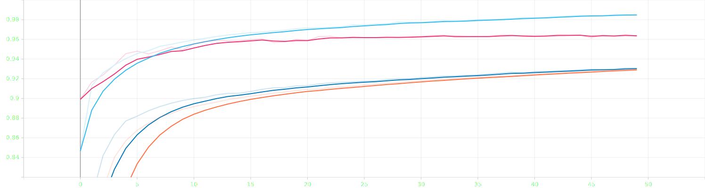
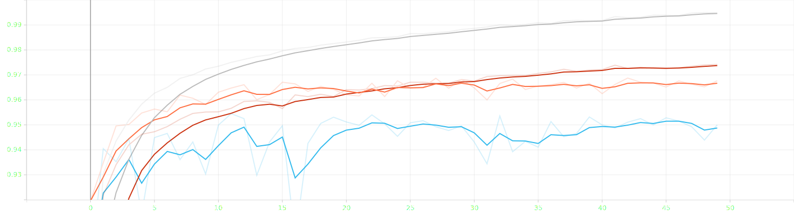

# a.Går det snabbare att träna nätverken (i antalet epoker) om vi ökar inlärningshastigheten (lr) på nätverken. Kan vi ha en för stor inlärningshastighet och vad händer då?
    Högre inlärnings hastighet ökar epoch accuracy, men för hög inlärnings hastighet gör så att accuracy minskar och inlärnings processen blir ostabil (för lr=1 så ser man hur grafen för validation(ljusblå) blir volatil). Man måste hitta en equlibrium mellan hög och låg hastighet. Se graferna nedan.

# b.Vad händer om vi minskar storleken på våra träningsbatcher (batch_size)?Hur ändras prestandardenoch träningstiden.

# c.Hur skiljer de båda modellerna sig när det kommer till träningstid? Förklara lite kort om varförde skiljer sig åt.

# d.Hur skiljer sig resultatet mellan de olika testseten och varför kan vi se/inte se en skillnad?Är det samma skillnader för båda närverken?

# e.Vad händer om vi ökar antalet neuroner. Får vi ett bättre eller sämre resultat. Finns det någon undre eller övre gräns för vad som är bäst?

# f.Öka området som analyseras åt gången medvårt ”convolutional neural network” (detta görs genom att öka värdet på vår kernel_size) och öka även storleken på stegen mellan varje yta som analyseras ” (detta görs genom att öka värdet på strides). Hur stora värden går det att ha på dessa parametrar innan prestandan börjar att sjunka. Vilka var de bästa värdena som du observerade?

# g.Lägg till fler lager och testa om det blir bättre med djupare nätverk. Hur påverkas precisionen och träningstiden?

# Här är mina resultat hittils:

I den här filen ska ni beskriva:
- Era experiment
- Era slutsatser

## Glöm inte!

Glöm inte att ha med figurer:

