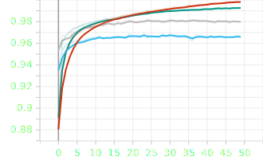
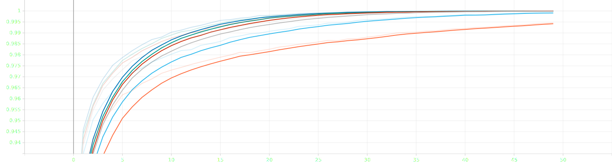
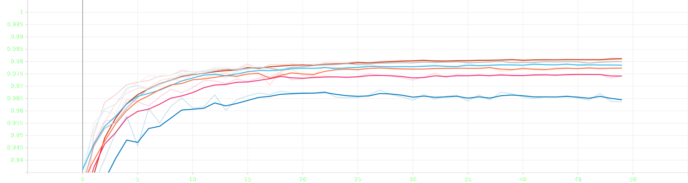
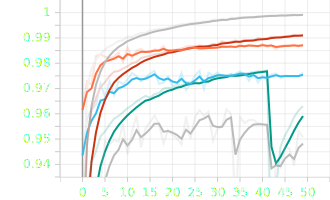
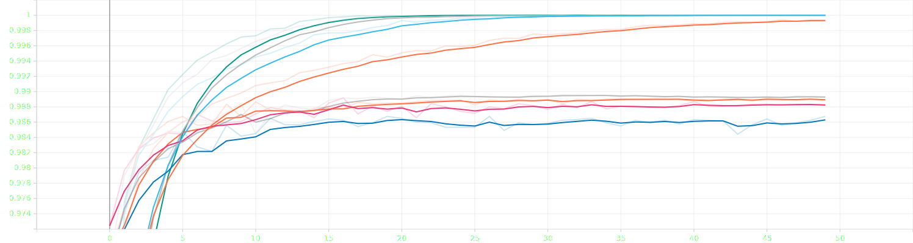

# a.Går det snabbare att träna nätverken (i antalet epoker) om vi ökar inlärningshastigheten (lr) på nätverken. Kan vi ha en för stor inlärningshastighet och vad händer då?
    Högre inlärnings hastighet ökar epoch accuracy, men för hög inlärnings hastighet gör så att accuracy minskar och inlärnings processen blir ostabil (för lr=1 så ser man hur grafen för validation(ljusblå) blir volatil). Man måste hitta en equlibrium mellan hög och låg hastighet. Se graferna nedan.

# b.Vad händer om vi minskar storleken på våra träningsbatcher (batch_size)?Hur ändras prestandardenoch träningstiden.
    En batch size är antalet träningsexempel i en iteration.Ju mer batch size ju mer minne behövs, därav ger minskad batch_size helt enkelt i en långsammare träningstid.

# c.Hur skiljer de båda modellerna sig när det kommer till träningstid? Förklara lite kort om varförde skiljer sig åt.
    CNN, convolutional model är mycket långsammare än non convolutional. CNN uppnår dock en högre accuracy.
    En convolutional-neural-network är en subklass av neural-network som har åtminstone minst ett convolutional layer. Används exempelvis inom lokal information som t.ex pixlar som omgiver en pixel i en bild och minskar även komplexiteten i modellen.
    I exemplet ovan skulle en non conventional å andra sidan gå igen alla pixlar.

# d.Hur skiljer sig resultatet mellan de olika testseten och varför kan vi se/inte se en skillnad?Är det samma skillnader för båda närverken?
    Som man ser på resultaten så har convolutional ett mycket strörre move data accuracy än non convolutional. När man kollar på resterande resulat så är inte skillnaded lika stora.

    Convolutional:
        Moved Data:     21.34
        Rotated Data:   85.33
        Test Data:      97.93
        Train Data:     99.04
        
    Non Convolutional:
        Moved Data:     15.09
        Rotated Data:   82.47
        Test Data:      96.63
        Train Data:     99.29

# e.Vad händer om vi ökar antalet neuroner. Får vi ett bättre eller sämre resultat. Finns det någon undre eller övre gräns för vad som är bäst?
    För testet användes neuron värdena 32,64,128,256,512,1024 i non_convolutional_model.
    När man ökar antalet neuron så ökar accuracy men det kräver mer kraft/tid för att utföra beräkningar. Som vi ser på graferna så ökar epoch_accuracy för varje ökning av neuron antalet. Vi kan också se att vid 1024 och 512 antal neuroner så är ökningen minimal men det tar nästan dubbelt så lång tid per epoch (5ms för 512, 10ms 1024).
    Den övre gränsen blir då 512 neuroner och den undre gränsen blir 128 neuroner enligt graferna.

# f.Öka området som analyseras åt gången medvårt ”convolutional neural network” (detta görs genom att öka värdet på vår kernel_size) och öka även storleken på stegen mellan varje yta som analyseras ” (detta görs genom att öka värdet på strides). Hur stora värden går det att ha på dessa parametrar innan prestandan börjar att sjunka. Vilka var de bästa värdena som du observerade?
    Första testet som kördes var kernel_size (8,8) och strides (1,1). Resultatet i rotated data blev 88.3
    Första testet som kördes var kernel_size (16,16) och strides (2,2) och resultatet på roterad data blev lite sämre(från 88.37 -> 86.26)
    Andra testet som kördes var kernel_size(24,24) och strides (4,4) och resultatet blev ännu sämre: 75.2.

    I bilden är den gråa kernel_size(8,8) och strides (1,1). Som visas syns det att resten av ökningarna ger sämre accuracy.

# g.Lägg till fler lager och testa om det blir bättre med djupare nätverk. Hur påverkas precisionen och träningstiden?
    Fyra tester kördes med base (utan lager),1,2 och 3 antal lager (32,64,128 neuroner). Körnings tiden har gått upp en liten bit men inte så mycket.
    Som vi ser på bilden nere så har träningn och validation accuracy ökat per lager. När det kom till moved och rotated accuracy så har moved accuracy minskat och rotated accuracy ökat per layer.

# Fråga 8
# Här är mina resultat hittils:
    För den första testet kördes väderna batch_size = 512, lr = 0.1 , 3 layers (32,64,128).
    Det gav värderna :
        Moved Data:     19.01
        Rotated Data:   90.79
        Test Data:      98.61
        Train Data:     99.25
    Det tog mindre tid att köra men accuracy var inte den bästa.

    För den andra testet kördes värderna batch_size = 256 , lr = 0.1 , 2 layers (32,64)
    Den gav värderna:
        Moved Data:     21.38
        Rotated Data:   91.31
        Test Data:      98.88
        Train Data:     99.74
    Dessa värden gav att lite långsammare kör tid per epoch (2 sec mer) men accuracy har ökat.

    För den tredje testet kördes värderna batch_size = 128 , lr = 0.1 , 2 layers (32,64)
    Den gav värderna:
        Moved Data:     21.62
        Rotated Data:   90.39
        Test Data:      98.88
        Train Data:     99.76
    För denna test så har vi testat sänka batch_size för att öka antal steg per epoch för att se om det kommer träna bättre. Körnings tiden har inte påverkats av detta. Moved data accuracy blev bättre men inte mycket, men rotated data accuracy har minskat.

    För den fjärde testet kördes värderna batch_size = 128 , lr = 0.1 , 1 layer 32
    Den gav värderna:
        Moved Data:     21.46
        Rotated Data:   90.29
        Test Data:      98.88
        Train Data:     99.75
    För denna test så har vi testat sänka antalet lager men det orsakde till att accuracy har blivit sämmre och hastigheten var oförändrad.

    För den femte testet kördes värderna batch_size = 128 , lr = 0.05 , 2 layers (32,64)
    Den gav värderna:
        Moved Data:     22.40
        Rotated Data:   91.69
        Test Data:      98.86
        Train Data:     99.74
    För denna test så har vi testat sänka inlärnings hastigheten och ta tillbaka ett lager (för att man fick sämmre resultat utan den). Det visade sig öka accuracy på både moved och rotated data samt det har inte ökat körnings tiden per epoch.

    För den sjätte testet kördes värderna batch_size = 128 , lr = 0.05 , 2 layers (256,512)
    Den gav värderna:
        Moved Data:     21.32
        Rotated Data:   92.01
        Test Data:      98.92
        Train Data:     99.75
    För denna test så har vi testat öka antal neuroner i de två olika lager. Moved accuracy har minskat med rotated accuracy har ökat.

    Från våra resultat kan vi se att test fem presterade bäst.
    Flera lager kombinerat med än lägre learning rate än tidigare testat visade sig till slut vara den skillnaden som gav bäst resultat. Som etablerat redan i 7a visade sig att en högre inlärning gav upphov till ett bättre resultat, men inte allt för mycket. 0.5 visade sig i detta fall vara den gyllene gränsen.
    Resten av siffrorna kom fram till genom att ta de som gav bäst resultat av tidigare tester, helt enkelt.

